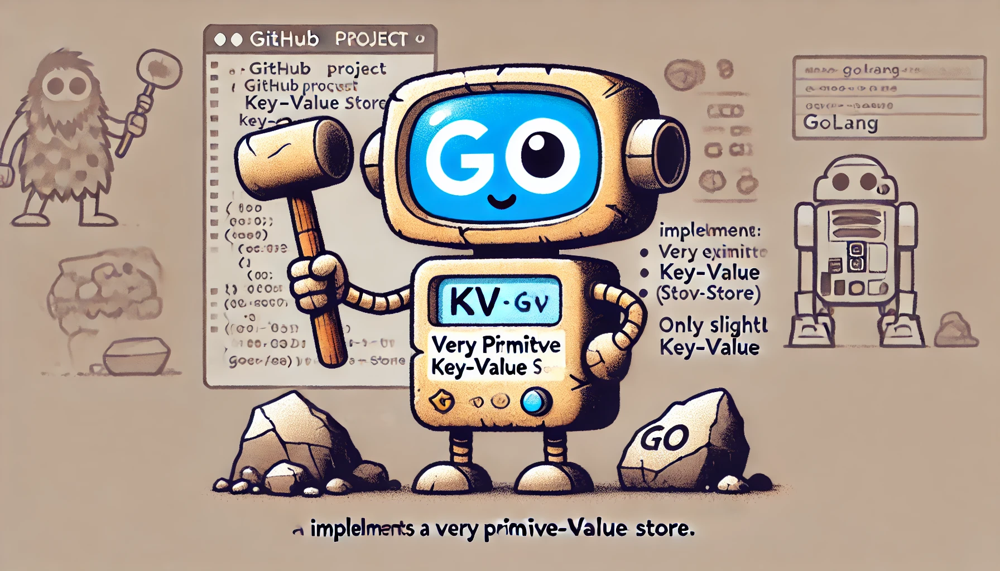

# The most advance KV Store the world has seen


Just kidding... Only a test / practice project to have some fun.

⚠️ It's definitely not finished, so expect some rough edges and ongoing changes as I mess around with it.


## usage

Start server:

```bash
make run
```

Set value:

```bash
$ curl localhost:8080/values/foo -X PUT -H "Content-Type: application/json" -d '{"value": "bar"}'
{"value":"added to store"}
```

```bash
$ curl localhost:8080/values/foo -X GET
{"value":"bar"}
```

## Inspiration

Most of initial content here will be inspired by KV Store implementation in [Cloud Native Go
by Matthew A. Titmus](https://www.oreilly.com/library/view/cloud-native-go/9781492076322/).
